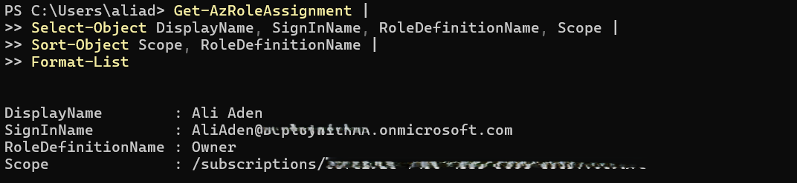
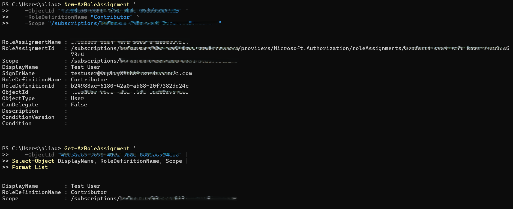
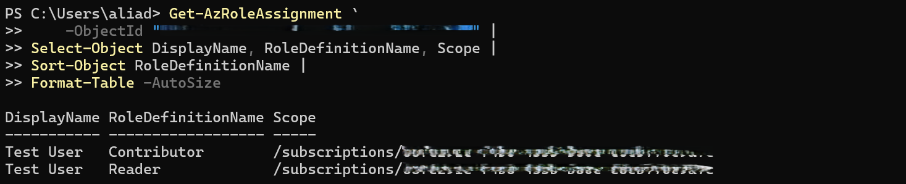
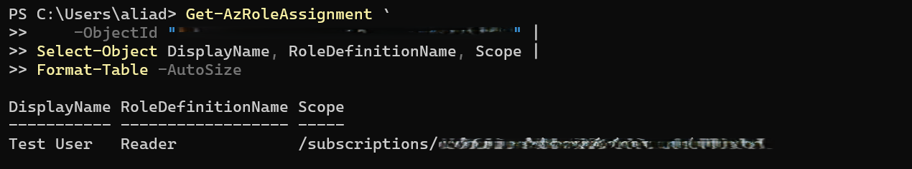
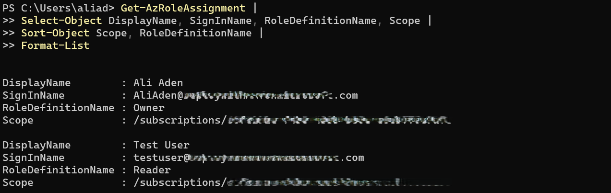

# Day 56 — Implement the Principle of Least Privilege Across Your Subscription

### Azure 100 Days of Cloud Challenge — Ali Aden

---

# Overview

For Day 56, I audited the Role-Based Access Control (RBAC) assignments across my Azure subscription to identify whether any users had more permissions than they required.

The initial audit confirmed that the subscription only contained the required Owner role assignment for my administrator account, meaning no over-privileged user assignments existed. To demonstrate the complete least privilege process, I created a controlled lab scenario by temporarily assigning the **Contributor** role to a test user at the subscription scope.

After identifying the excessive permission, I remediated the assignment by first granting the **Reader** role, verifying the new permissions and then removing the **Contributor** role. Finally, I performed a second RBAC audit to confirm that the user retained only the minimum permissions required.

This project demonstrates how Azure RBAC can be used to implement the Principle of Least Privilege, helping organisations reduce unnecessary permissions, minimise the potential impact of compromised accounts and improve overall security governance.

---

# Technologies Used

- Microsoft Azure
- Microsoft Entra ID
- Azure Role-Based Access Control (RBAC)
- Azure PowerShell (Az Module)
- Windows PowerShell
- Azure Subscription
- Identity and Access Management (IAM)

---

# Architecture Diagram

## ASCII Architecture

```text
                                        +--------------------------------------+
                                        |      Microsoft Entra ID Tenant       |
                                        |          (Identity Provider)         |
                                        +------------------+-------------------+
                                                           |
                          +--------------------------------+--------------------------------+
                          |                                                                 |
                 +--------v---------+                                           +-----------v-----------+
                 |    Ali Aden      |                                           |      Test User        |
                 | Subscription Owner|                                           | Standard User Account |
                 +--------+---------+                                           +-----------+-----------+
                          |                                                                 |
                          | Performs RBAC Audit                                             |
                          +----------------------------+------------------------------------+
                                                       |
                                                       v
                                     +------------------------------------------+
                                     |        Azure Subscription                |
                                     |            (RBAC Scope)                  |
                                     +------------------+-----------------------+
                                                        |
                                                        v
                                     +------------------------------------------+
                                     | Initial RBAC Audit                       |
                                     |------------------------------------------|
                                     | Ali Aden -> Owner                        |
                                     | No over-privileged assignments found     |
                                     +------------------+-----------------------+
                                                        |
                                   Controlled Least Privilege Scenario
                                                        |
                                                        v
                                     +------------------------------------------+
                                     | Test User                               |
                                     | Contributor (Subscription Scope)        |
                                     +------------------+-----------------------+
                                                        |
                                             RBAC Remediation
                                                        |
                                                        v
                                     +------------------------------------------+
                                     | Assign Reader                           |
                                     | Verify Assignment                       |
                                     | Remove Contributor                      |
                                     +------------------+-----------------------+
                                                        |
                                                        v
                                     +------------------------------------------+
                                     | Final RBAC Audit                        |
                                     |------------------------------------------|
                                     | Ali Aden -> Owner                       |
                                     | Test User -> Reader                     |
                                     +------------------------------------------+
```

---

# Azure Configuration

| Component | Configuration |
|---|---|
| Azure Service | Azure Role-Based Access Control (RBAC) |
| Subscription | Azure Subscription |
| Administrator Account | Ali Aden |
| Test Identity | Test User |
| Initial Test Role | Contributor |
| Final Role | Reader |
| RBAC Scope | Subscription |
| Validation Method | Azure PowerShell (Az Module) |
| Remediation Approach | Assign Reader before removing Contributor |
| Security Principle | Principle of Least Privilege |

---

# Implementation

### 1. Performed an Initial RBAC Audit

I started by auditing every role assignment across my Azure subscription using Azure PowerShell.

The audit confirmed that only my administrator account had the **Owner** role assigned at the subscription scope. No over-privileged user assignments were identified during the initial review.

This demonstrated that the subscription was already following good RBAC practices before making any changes.

---

### 2. Created a Controlled Least Privilege Scenario

Since no over-privileged assignments existed, I created a controlled lab scenario using the **Test User** account.

I temporarily assigned the **Contributor** role at the subscription scope to simulate an excessive permission assignment that might be identified during a real security audit.

Creating the assignment allowed me to demonstrate the complete least privilege remediation process without affecting the administrator account or any production identities.

---

### 3. Applied the Principle of Least Privilege

After verifying that the Test User had the **Contributor** role, I reduced the permissions by first assigning the **Reader** role.

Following Microsoft's recommended approach, I added the replacement role before removing the existing one. This ensured the user always retained the required access during the transition.

Once the Reader role had been successfully assigned, I removed the Contributor role from the Test User.

---

### 4. Verified the RBAC Changes

After removing the Contributor assignment, I verified that only the Reader role remained.

Finally, I performed another subscription-wide RBAC audit to confirm the remediation was successful.

The final audit showed that the administrator account retained the required Owner role while the Test User had only the Reader role, demonstrating successful implementation of the Principle of Least Privilege.

---

# Validation

### Initial RBAC Audit



I performed an initial audit of the Azure subscription to review all existing RBAC assignments. The results confirmed that only the required Owner role assignment existed and no over-privileged user assignments were present.

---

### Controlled Over-Privileged Assignment



To demonstrate the remediation process, I created a controlled lab scenario by assigning the Contributor role to the Test User at the subscription scope and verified the assignment using Azure PowerShell.

---

### Assign Reader Role



Before removing the Contributor role, I assigned the Reader role and confirmed that both role assignments temporarily existed. This follows Microsoft's recommended approach for safely reducing permissions.

---

### Least Privilege Verified



After removing the Contributor role, I verified that only the Reader role remained for the Test User, confirming that the excessive permissions had been successfully removed.

---

### Final RBAC Audit



I completed a final subscription-wide RBAC audit to validate the remediation. The results confirmed that the administrator account retained the Owner role while the Test User now had only the Reader role.

---

# RBAC Audit Findings

| Identity | Original Role | Original Scope | New Role | New Scope | Reason for Change |
|---|---|---|---|---|---|
| Test User | Contributor | Subscription | Reader | Subscription | Reduced permissions to follow the Principle of Least Privilege. In a production environment, this assignment would normally be scoped to the required resource group or individual resource instead of the entire subscription. |

---

# Skills Demonstrated

- Azure Role-Based Access Control (RBAC)
- Microsoft Entra ID
- Identity and Access Management (IAM)
- Principle of Least Privilege
- Azure PowerShell (Az Module)
- Azure Subscription Administration
- Security Governance
- RBAC Auditing
- Permission Remediation
- Technical Documentation

---

# Project Outcome

In this project, I audited the RBAC assignments across my Azure subscription to review whether any identities had excessive permissions.

The initial audit confirmed that no over-privileged user assignments existed, so I created a controlled lab scenario using a Test User to demonstrate the complete least privilege remediation process. I assigned the Contributor role, replaced it with the Reader role and then removed the broader permission before validating the final RBAC configuration.

This project demonstrates how Azure RBAC can be used to audit permissions, reduce unnecessary access and implement the Principle of Least Privilege using a safe and structured remediation process.