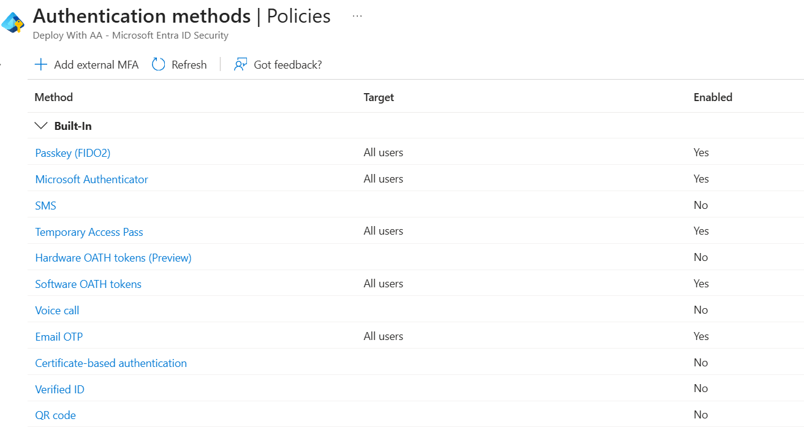
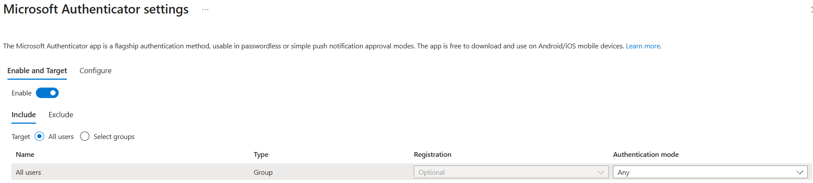
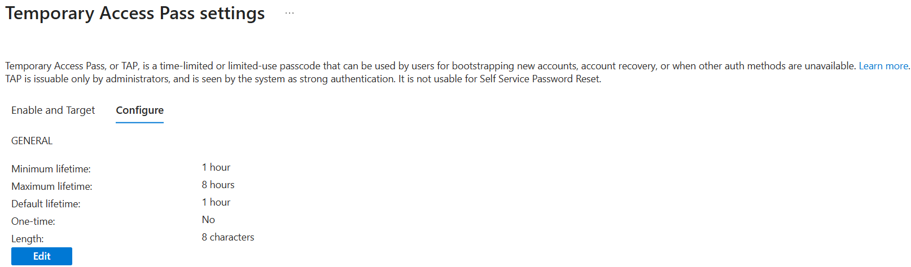
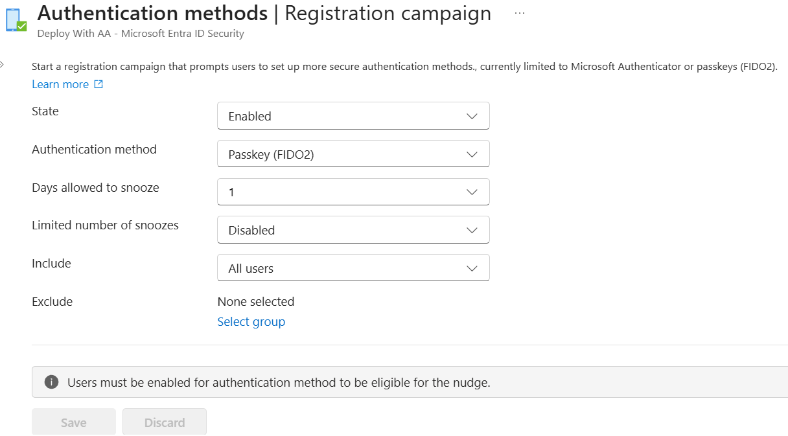

# Day 57 — Configure Multi-Factor Authentication Methods and Registration Policy

### Azure 100 Days of Cloud Challenge — Ali Aden

---

# Overview

For Day 57, I configured the Authentication Methods Policy in Microsoft Entra ID to review and manage which multi-factor authentication (MFA) methods are available across the tenant.

The project focused on strengthening identity security by verifying that Microsoft Authenticator and Temporary Access Pass (TAP) were enabled, confirming that SMS authentication remained disabled and configuring the Registration Campaign to encourage all users to register stronger authentication methods using Passkey (FIDO2).

During the project I also reviewed how Microsoft has updated the Microsoft Entra portal. While older documentation refers to the MFA Registration Policy, the current portal now uses the Registration Campaign to encourage users to register phishing-resistant authentication methods.

This project demonstrates how Authentication Methods policies can be used to improve identity security, reduce reliance on weaker authentication methods and encourage users to adopt stronger forms of multi-factor authentication.

---

# Technologies Used

- Microsoft Azure
- Microsoft Entra ID
- Authentication Methods Policy
- Microsoft Authenticator
- Temporary Access Pass (TAP)
- Registration Campaign
- Passkey (FIDO2)
- Identity and Access Management (IAM)

---

# Architecture Diagram

## ASCII Architecture

```text
                     Microsoft Entra ID
                             │
                             ▼
              Authentication Methods Policy
                             │
      ┌──────────────┬──────────────┬──────────────┐
      │              │              │
      ▼              ▼              ▼
Microsoft      Temporary        SMS
Authenticator  Access Pass      Disabled
   Enabled       Enabled      (Not Allowed)
                     │
                     ▼
             Registration Campaign
               State: Enabled
               Scope: All Users
           Promote: Passkey (FIDO2)
                     │
                     ▼
      User Signs In to Microsoft Entra
                     │
                     ▼
 Prompt to Register a Strong Authentication Method
                     │
                     ▼
      Strong Authentication Registered
```

---

# Azure Configuration

| Component | Configuration |
|---|---|
| Azure Service | Microsoft Entra ID |
| Authentication Policy | Authentication Methods |
| Primary Authentication Method | Microsoft Authenticator |
| Temporary Authentication | Temporary Access Pass |
| Weaker Authentication Method | SMS (Disabled) |
| Registration Policy | Registration Campaign |
| Registration Scope | All Users |
| Promoted Authentication Method | Passkey (FIDO2) |
| Identity Platform | Microsoft Entra ID |
| Security Objective | Strengthen MFA Registration and Authentication |

---

# Implementation

### 1. Reviewed the Authentication Methods Policy

I started by reviewing the Authentication Methods policy in Microsoft Entra ID to understand which authentication methods were currently available across the tenant.

The review showed that Microsoft Authenticator, Temporary Access Pass and Passkey (FIDO2) were already enabled, while SMS and Voice Call authentication remained disabled. Establishing this baseline made it easier to validate the tenant's existing security posture before making any configuration changes.

---

### 2. Verified Microsoft Authenticator Configuration

Next, I reviewed the Microsoft Authenticator policy to confirm that it was enabled for all users and configured with the **Authentication Mode** set to **Any**.

Microsoft Authenticator is Microsoft's recommended MFA method because it provides stronger protection than SMS authentication while also supporting passwordless sign-in capabilities.

---

### 3. Reviewed Temporary Access Pass Configuration

I then reviewed the Temporary Access Pass (TAP) policy to verify that it was available for user onboarding and account recovery.

The configuration was already aligned with Microsoft's recommended settings, using a minimum lifetime of **1 hour** and a maximum lifetime of **8 hours**. These settings provide users with enough time to register a permanent authentication method while ensuring the temporary pass expires quickly.

---

### 4. Configured the Registration Campaign

To encourage stronger authentication across the tenant, I configured the Registration Campaign and changed the policy from **Microsoft managed** to **Enabled**.

The campaign was configured to target **All users** and promote **Passkey (FIDO2)** registration. This encourages users to adopt phishing-resistant authentication methods when signing in to Microsoft Entra ID.

---

### 5. Validated the Authentication Configuration

After completing the configuration, I performed a final review of the Authentication Methods policy to confirm that the required settings were applied successfully.

The validation confirmed that Microsoft Authenticator and Temporary Access Pass remained enabled, SMS authentication remained disabled and the Registration Campaign was enabled for all users.

---

# Validation

### Authentication Methods Overview



I started by reviewing the Authentication Methods policy to identify which authentication methods were enabled across the tenant. The initial review confirmed that Microsoft Authenticator, Temporary Access Pass and Passkey (FIDO2) were enabled, while SMS and Voice Call authentication remained disabled.

---

### Microsoft Authenticator Policy



I reviewed the Microsoft Authenticator configuration and confirmed that it was enabled for all users with the **Authentication Mode** configured as **Any**. This allows users to register Microsoft Authenticator for both push notifications and passwordless authentication.

---

### Temporary Access Pass Configuration



I verified that Temporary Access Pass (TAP) was enabled and configured with a minimum lifetime of **1 hour** and a maximum lifetime of **8 hours**. This provides a secure onboarding and recovery method while limiting the lifetime of temporary credentials.

---

### Registration Campaign



I configured the Registration Campaign by changing the policy from **Microsoft managed** to **Enabled** and targeting **All users**. The campaign promotes **Passkey (FIDO2)** registration, encouraging users to adopt phishing-resistant authentication methods when signing in to Microsoft Entra ID.

---

# Skills Demonstrated

- Microsoft Entra ID
- Identity and Access Management (IAM)
- Multi-Factor Authentication (MFA)
- Authentication Methods Policy
- Microsoft Authenticator
- Temporary Access Pass (TAP)
- Registration Campaign
- Passkey (FIDO2)
- Identity Security
- Security Policy Configuration
- Authentication Governance
- Technical Documentation

---

# Project Outcome

In this project, I reviewed and configured the Authentication Methods Policy in Microsoft Entra ID to strengthen authentication security across the tenant.

I verified that Microsoft Authenticator and Temporary Access Pass were enabled, confirmed that SMS authentication remained disabled and configured the Registration Campaign to encourage all users to register stronger authentication methods using Passkey (FIDO2).

During the project, I also noticed that Microsoft has updated the Microsoft Entra portal. While older documentation refers to the **MFA Registration Policy**, the current experience uses the **Registration Campaign** to encourage users to register phishing-resistant authentication methods.

This project demonstrates how Microsoft Entra ID can be used to manage authentication methods, improve MFA adoption and strengthen identity security by promoting modern authentication methods while reducing reliance on weaker options such as SMS.