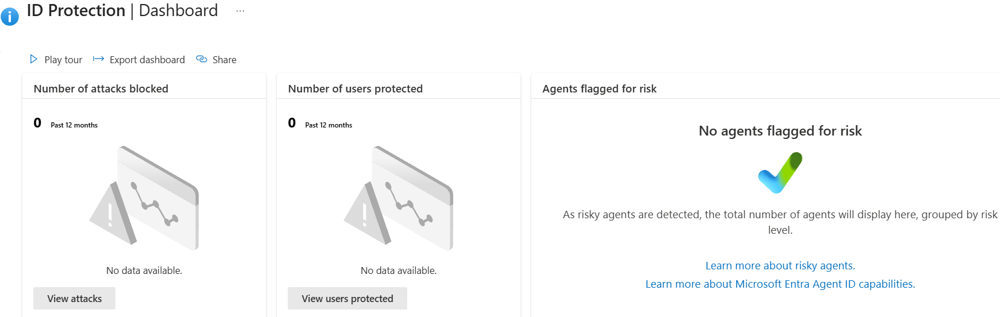
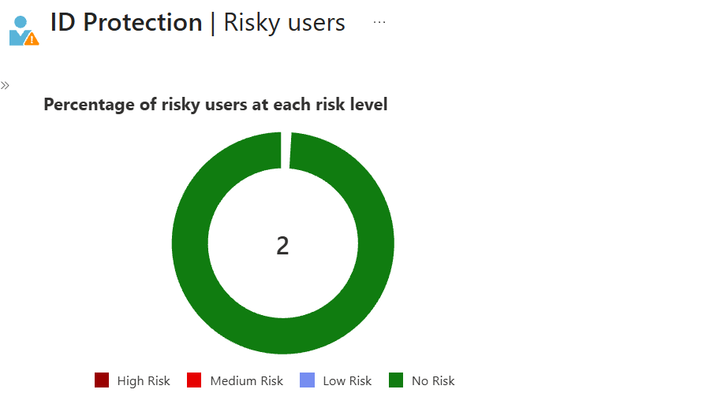
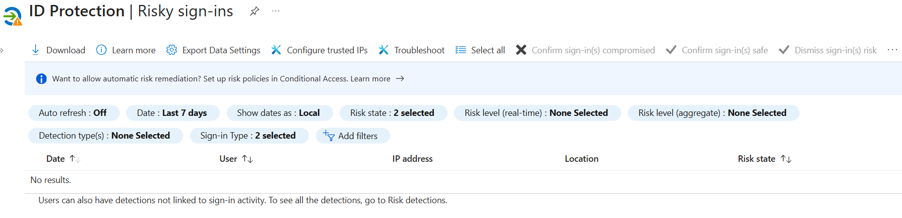
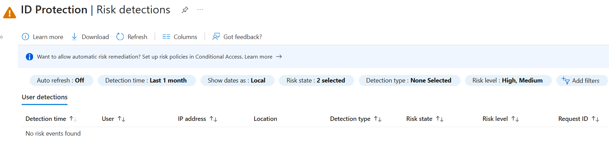

# Day 58: Set Up Identity Protection and Review Risky Users

### Azure 100 Days of Cloud Challenge — Ali Aden

## Project Overview

For Day 58 of my Azure 100 Days Challenge, I explored Microsoft Entra ID Identity Protection to understand how organisations detect, investigate and respond to identity-based security risks. Identity Protection continuously analyses user authentication activity using Microsoft's global threat intelligence to identify potentially compromised accounts and suspicious sign-in behaviour.

During this project, I reviewed the ID Protection Dashboard, investigated the Risky Users, Risky Sign-ins and Risk Detections reports, and attempted to generate a risk signal by signing in with a test user from a separate browser using a private browsing session. Although no identity risks were detected during testing, the project provided valuable hands-on experience navigating Identity Protection, understanding Microsoft's risk assessment process and learning how security teams investigate identity-related security events.

---

## Technologies Used

- Microsoft Azure
- Microsoft Entra ID
- Microsoft Entra ID Identity Protection
- Microsoft Entra ID P2
- Azure Portal
- Identity Security Monitoring

---

## Architecture Diagram

```text
                          Microsoft Entra ID
                                 │
                                 ▼
                     ID Protection Dashboard
                                 │
         ┌───────────────────────┼────────────────────────┐
         │                       │                        │
         ▼                       ▼                        ▼
    Risky Users           Risky Sign-ins          Risk Detections
         │                       │                        │
         └───────────────────────┼────────────────────────┘
                                 │
                                 ▼
                  Security Investigation & Analysis
                                 │
                                 ▼
                   Identity Risk Assessment
                                 │
                                 ▼
                      No Risk Detected
                                 │
                                 ▼
                    No Identity Risks Identified
```

---

## Project Objectives

- Review the Microsoft Entra ID Protection Dashboard.
- Investigate the Risky Users report.
- Review Risky Sign-ins and Risk Detections.
- Understand how Microsoft Entra ID evaluates identity risks.
- Attempt to generate a risk signal using a test user account.
- Learn how security analysts investigate identity-related security events.
- Document the investigation process and findings.

---

## Azure Configuration

| Component | Configuration |
|------------|---------------|
| Azure Service | Microsoft Entra ID Identity Protection |
| Identity Platform | Microsoft Entra ID |
| Microsoft Entra Licence | Microsoft Entra ID P2 |
| Identity Protection Dashboard | Reviewed |
| Risky Users Report | Reviewed |
| Risky Sign-ins Report | Reviewed |
| Risk Detections Report | Reviewed |
| Test User | Microsoft Entra ID Test User |
| Test Activity | Sign-in from a separate browser using a private browsing session |
| Result | No identity risks detected |

---

# Implementation

### 1. Reviewed the ID Protection Dashboard

I started by reviewing the Microsoft Entra ID Protection Dashboard to understand the tenant's current identity security posture. The dashboard provides a high-level overview of Identity Protection and acts as the starting point for investigating identity-related security events.

---

### 2. Investigated the Risky Users Report

Next, I reviewed the Risky Users report to determine whether Microsoft had identified any potentially compromised user accounts.

The report showed that both users in the tenant were classified as **No Risk**, indicating that no user accounts had been flagged for suspicious activity or signs of compromise.

---

### 3. Reviewed the Risky Sign-ins Report

I then reviewed the Risky Sign-ins report to investigate whether Microsoft had detected any suspicious authentication attempts.

The report returned **No results**, confirming that no sign-in events had been assessed as risky during the selected reporting period.

---

### 4. Reviewed the Risk Detections Report

After reviewing risky sign-ins, I examined the Risk Detections report to determine whether Microsoft had detected any identity-related threats such as leaked credentials, impossible travel or anonymous IP usage.

The report showed **No risk events found**, confirming that no identity risk detections had been generated within the tenant.

---

### 5. Attempted to Generate a Risk Signal

To better understand how Identity Protection responds to authentication activity, I reset the test user's password and signed in using a different browser in a private browsing session.

After allowing time for Microsoft Entra ID to process the authentication event, I reviewed the Identity Protection reports again. No risky users, risky sign-ins or risk detections were generated, demonstrating that Microsoft assessed the activity as legitimate and did not raise a false positive.

---

# Validation

### Identity Protection Dashboard



I reviewed the ID Protection Dashboard to understand the current identity security posture before investigating individual reports.

---

### Risky Users Report



I confirmed that both users within the tenant were assessed as **No Risk**, indicating that Microsoft had not identified any potentially compromised user accounts.

---

### Risky Sign-ins Report



I reviewed the Risky Sign-ins report and confirmed that no suspicious authentication events had been detected during the reporting period.

---

### Risk Detections Report



I reviewed the Risk Detections report and confirmed that Microsoft Entra ID had not identified any identity-related threat detections requiring investigation or remediation.

---

# Skills Demonstrated

- Microsoft Entra ID Identity Protection
- Identity and Access Management (IAM)
- Identity Security Monitoring
- Identity Risk Investigation
- Risky Users Analysis
- Risky Sign-ins Analysis
- Risk Detection Review
- Microsoft Entra ID P2
- Security Monitoring
- Security Investigation
- Azure Portal Administration
- Technical Documentation

---

# Project Outcome

In this project, I explored Microsoft Entra ID Identity Protection to understand how Microsoft monitors and investigates identity-based security threats across an organisation.

I reviewed the ID Protection Dashboard, investigated the Risky Users, Risky Sign-ins and Risk Detections reports, and attempted to generate a risk signal by signing in with a test user from a separate browser using a private browsing session.

Although no identity risks were detected during testing, the project demonstrated how Identity Protection analyses authentication activity before classifying a user or sign-in as risky. It also reinforced that changing browsers or using a private browsing session alone is not enough to trigger a risk event, as Microsoft relies on multiple threat intelligence signals before raising an alert.

This project provided practical experience navigating Microsoft Entra ID Identity Protection, reviewing identity risk reports and understanding how security teams investigate identity-related threats before deciding whether remediation is required.