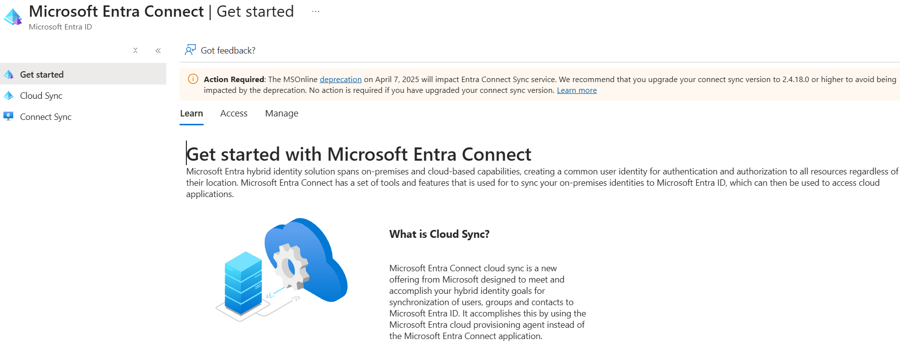
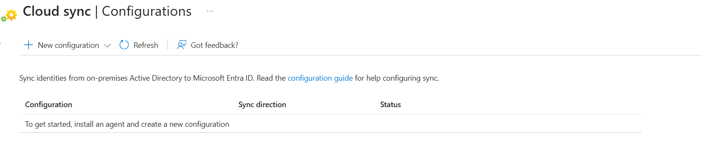
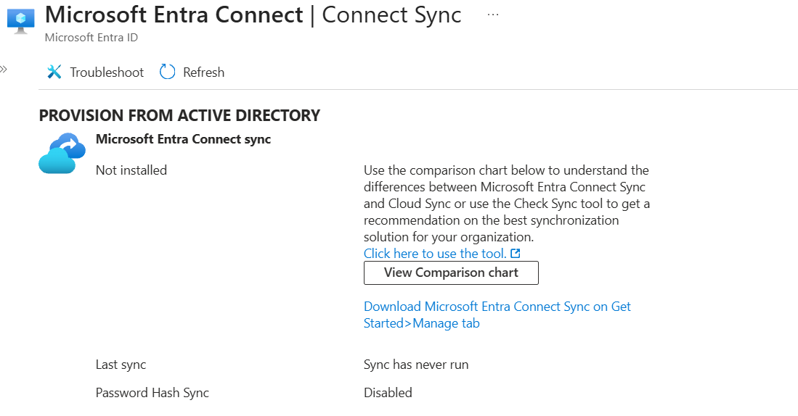
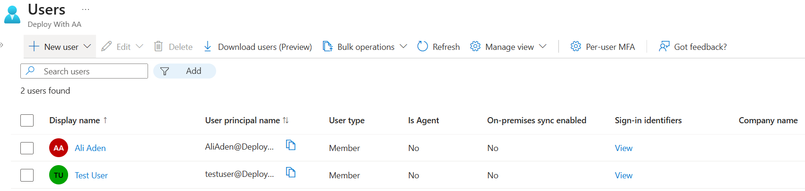

# Day 59: Configure Hybrid Identity with Password Hash Synchronisation Concepts

### Azure 100 Days of Cloud Challenge — Ali Aden

## Project Overview

For Day 59 of my Azure 100 Days Challenge, I explored how organisations connect their on-premises Active Directory environment with Microsoft Entra ID using Microsoft Entra Connect.

Unlike previous projects where I deployed Azure resources, this challenge focused on understanding hybrid identity architecture and how identities are synchronised between an on-premises environment and the cloud. Since Microsoft Entra Connect requires an on-premises Windows Server Active Directory environment, this project was completed by exploring the Microsoft Entra Connect features available within the Azure portal, documenting the different hybrid authentication methods and designing the overall hybrid identity architecture.

During the project, I reviewed Microsoft Entra Connect, Cloud Sync and Connect Sync within Microsoft Entra ID, confirmed that my tenant is currently cloud-only, and documented how Password Hash Synchronisation, Pass-through Authentication and Federation (AD FS) are used in enterprise environments.

---

## Technologies Used

- Microsoft Azure
- Microsoft Entra ID
- Microsoft Entra Connect
- Microsoft Entra Connect Sync
- Microsoft Entra Cloud Sync
- Windows Server Active Directory (Conceptual)
- Password Hash Synchronisation (PHS)
- Pass-through Authentication (PTA)
- Federation (AD FS)
- Microsoft 365

---

## Architecture Diagram

```text
                    On-Premises Environment
┌─────────────────────────────────────────────────────┐
│                                                     │
│      Windows Server Active Directory (AD DS)        │
│                                                     │
└──────────────────────────┬──────────────────────────┘
                           │
                    Identity Synchronisation
                           │
                           ▼
                 Microsoft Entra Connect
                           │
              Synchronises Users & Groups
                           │
                           ▼
                 Microsoft Entra ID
                           │
          ┌────────────────┴────────────────┐
          │                                 │
          ▼                                 ▼
 Password Hash                     Pass-through
 Synchronisation                   Authentication
          │                                 │
          └────────────────┬────────────────┘
                           ▼
      Microsoft 365 • Azure • SaaS Applications
```

---

## Project Objectives

- Understand how hybrid identity works in enterprise environments.
- Explore Microsoft Entra Connect within Microsoft Entra ID.
- Review Cloud Sync and Connect Sync capabilities.
- Learn the differences between Password Hash Synchronisation, Pass-through Authentication and Federation (AD FS).
- Understand how identities are synchronised between Windows Server Active Directory and Microsoft Entra ID.
- Review how cloud-only users differ from synchronised users.
- Document common hybrid identity failure scenarios and how administrators respond to them.

---

## Azure Configuration

| Component | Configuration |
|------------|---------------|
| Azure Service | Microsoft Entra ID |
| Hybrid Identity Service | Microsoft Entra Connect |
| Synchronisation Services Reviewed | Cloud Sync, Connect Sync |
| Hybrid Authentication Methods | Password Hash Synchronisation (PHS), Pass-through Authentication (PTA), Federation (AD FS) |
| Identity Source | Cloud-only Microsoft Entra ID tenant |
| On-premises Synchronisation | Not Configured |
| On-premises Sync Enabled | No |
| Deployment Type | Conceptual architecture and portal exploration |

---

# Implementation

### 1. Reviewed Microsoft Entra Connect

I began by exploring Microsoft Entra Connect within the Microsoft Entra admin centre to understand how Microsoft enables hybrid identity between on-premises Active Directory and Microsoft Entra ID.

The Get Started page introduced the purpose of Microsoft Entra Connect and explained how organisations synchronise identities from an on-premises environment to the cloud.

---

### 2. Explored Cloud Sync

Next, I reviewed the Cloud Sync configuration page.

Although no Cloud Sync configuration had been deployed in my tenant, the portal demonstrated where administrators configure synchronisation between Windows Server Active Directory and Microsoft Entra ID using the Microsoft Entra provisioning agent.

This helped me understand Microsoft's modern synchronisation approach for hybrid identity environments.

---

### 3. Reviewed Connect Sync

I then explored the Connect Sync page to understand Microsoft's traditional synchronisation service.

The portal confirmed that Microsoft Entra Connect Sync was not installed, Password Hash Synchronisation was disabled and no synchronisation had ever been performed. This was expected because my lab environment does not contain an on-premises Windows Server Active Directory domain.

Reviewing this page helped me understand where administrators manage synchronisation and monitor the health of hybrid identity deployments.

---

### 4. Reviewed User Synchronisation Status

Finally, I reviewed the Users page within Microsoft Entra ID and examined the **On-premises sync enabled** column.

Both user accounts displayed **No**, confirming that the tenant is cloud-only and that no identities are currently synchronised from an on-premises Active Directory environment.

This demonstrated the difference between a cloud-only Microsoft Entra ID tenant and a hybrid identity environment that uses Microsoft Entra Connect.

---

# Validation

### Microsoft Entra Connect Overview



I reviewed the Microsoft Entra Connect overview page to understand how organisations synchronise identities between Windows Server Active Directory and Microsoft Entra ID.

---

### Cloud Sync Overview



I explored the Cloud Sync configuration page and confirmed that no synchronisation configuration currently exists within the tenant.

---

### Connect Sync Overview



I reviewed the Connect Sync page and confirmed that Microsoft Entra Connect Sync is not installed, Password Hash Synchronisation is disabled and no synchronisation has been performed.

---

### User Synchronisation Status



I reviewed the user accounts within Microsoft Entra ID and confirmed that **On-premises sync enabled** is set to **No** for both users, verifying that the tenant is operating as a cloud-only environment rather than a hybrid identity deployment.

---

# Skills Demonstrated

- Hybrid Identity Concepts
- Microsoft Entra ID
- Microsoft Entra Connect
- Microsoft Entra Cloud Sync
- Microsoft Entra Connect Sync
- Password Hash Synchronisation (PHS)
- Pass-through Authentication (PTA)
- Federation (AD FS)
- Identity Synchronisation
- Identity and Access Management (IAM)
- Microsoft 365 Identity Integration
- Azure Portal Administration
- Technical Documentation
- Hybrid Identity Architecture

---

# Project Outcome

In this project, I explored how Microsoft Entra Connect enables hybrid identity by synchronising identities between an on-premises Windows Server Active Directory environment and Microsoft Entra ID.

Although a full deployment of Microsoft Entra Connect was not possible within my lab environment, I reviewed the Microsoft Entra Connect features available in the Azure portal, explored both Cloud Sync and Connect Sync, and confirmed that my tenant is currently operating as a cloud-only environment with no on-premises synchronisation configured.

I also developed a strong understanding of the three hybrid authentication methods used in enterprise environments. I learned how Password Hash Synchronisation allows users to authenticate directly with Microsoft Entra ID, how Pass-through Authentication validates credentials against an on-premises Active Directory in real time, and how Federation (AD FS) provides an alternative authentication model for organisations with more complex identity requirements.

Completing this project gave me a much better understanding of hybrid identity architecture, identity synchronisation and the operational decisions organisations make when integrating on-premises Active Directory with Microsoft Entra ID. This knowledge is highly relevant for cloud engineering and identity-focused roles, where hybrid identity remains a core part of many enterprise environments.