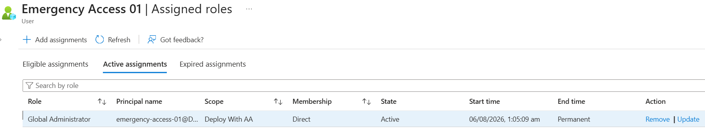
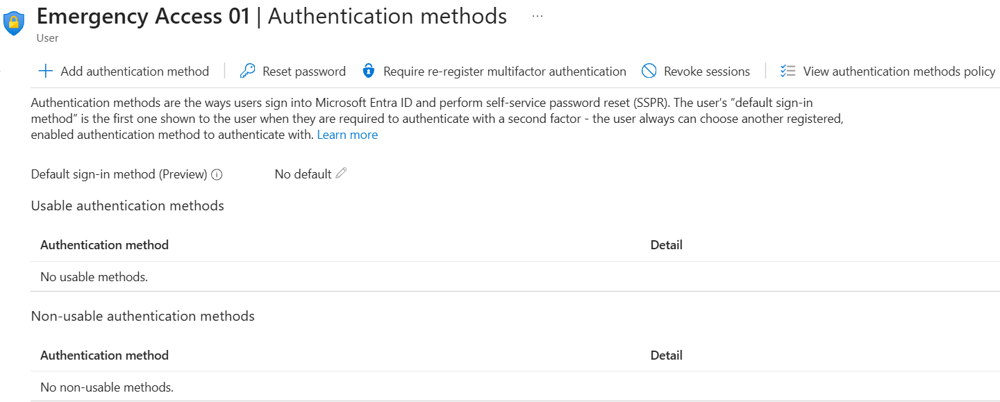
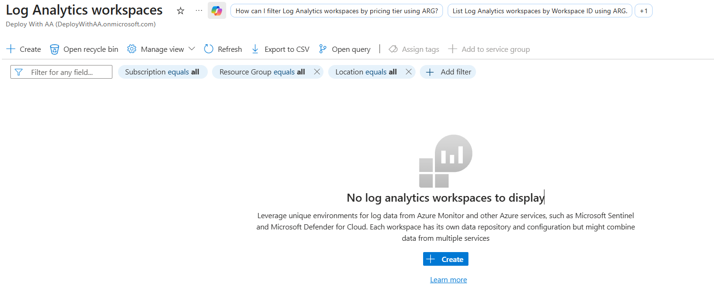

# Day 60 – Manage Emergency Access Accounts and Break-Glass Procedures

### Azure 100 Days of Cloud Challenge — Ali Aden

## Overview

For Day 60 of my Azure 100 Days Challenge, I explored how organisations protect themselves from being permanently locked out of their Microsoft Entra ID tenant by implementing emergency access (break-glass) accounts.

Emergency access accounts are highly privileged cloud-only administrator accounts that are reserved exclusively for emergency situations. Microsoft recommends maintaining at least two emergency access accounts that are permanently assigned the Global Administrator role, excluded from Conditional Access policies, and closely monitored for any sign-in activity.

In this project, I created two cloud-only emergency access accounts, assigned the Global Administrator role directly to each account, verified that no authentication methods were registered, and reviewed Microsoft's recommended monitoring approach. Since this lab was completed in a new Microsoft Entra tenant without existing Conditional Access policies or a Log Analytics workspace, I documented the current environment and explained how these recommendations would be implemented in a production environment.

---

## Objectives

- Understand the purpose of emergency access (break-glass) accounts.
- Create two cloud-only emergency access accounts.
- Assign the Global Administrator role directly to each account.
- Verify that no authentication methods are registered.
- Review Microsoft's recommendations for excluding emergency access accounts from Conditional Access policies.
- Understand how break-glass account sign-ins are monitored using Log Analytics and Microsoft Entra sign-in logs.
- Document the operational procedure for emergency tenant recovery.

---

## Architecture

```text
                  +--------------------------------------+
                  |      Microsoft Entra ID Tenant       |
                  +--------------------------------------+
                                |
        --------------------------------------------------------
        |                                                      |
        |                                                      |
+---------------------------+                 +---------------------------+
| Emergency Access 01       |                 | Emergency Access 02       |
| Cloud-Only Account        |                 | Cloud-Only Account        |
| Global Administrator      |                 | Global Administrator      |
| Permanent Assignment      |                 | Permanent Assignment      |
+---------------------------+                 +---------------------------+
        |                                                      |
        ------------------------+-------------------------------
                                 |
                                 |
                 +------------------------------------+
                 | Break-Glass Account Configuration  |
                 |------------------------------------|
                 | • No MFA Methods Registered        |
                 | • Strong, Long Passwords           |
                 | • Emergency Use Only               |
                 +------------------------------------+
                                 |
                                 |
                 +------------------------------------+
                 | Tenant Recovery Scenarios          |
                 |------------------------------------|
                 | • Conditional Access Failure       |
                 | • MFA Service Outage               |
                 | • Administrator Lockout            |
                 | • Identity Recovery                |
                 +------------------------------------+
                                 |
                                 |
                 +------------------------------------+
                 | Security Monitoring                |
                 |------------------------------------|
                 | Production Environment             |
                 | • Microsoft Entra Sign-in Logs     |
                 | • Log Analytics Workspace          |
                 | • Critical Alert on Sign-in        |
                 |                                    |
                 | Lab Environment                    |
                 | • No Log Analytics Workspace       |
                 | • Monitoring Not Configured        |
                 +------------------------------------+
```

---

## Azure Configuration

| Component | Configuration |
|------------|---------------|
| Identity Platform | Microsoft Entra ID |
| Emergency Access Accounts | 2 |
| Account Type | Cloud-Only |
| Administrative Role | Global Administrator |
| Role Assignment | Permanent Active |
| Authentication Methods | None Registered |
| Conditional Access Policies | None Present in Lab Tenant |
| Log Analytics Workspace | Not Configured |
| Monitoring | Production Recommendation Documented |
| Deployment Type | Hands-on Lab & Documentation |

---

# Implementation

### 1. Created Emergency Access Accounts

I created two cloud-only emergency access accounts within Microsoft Entra ID. These accounts are reserved for emergency situations where normal administrator accounts cannot access the tenant.

Microsoft recommends maintaining at least two emergency access accounts to ensure there is always a recovery path if one account becomes unavailable.

---

### 2. Assigned the Global Administrator Role

I assigned the Global Administrator role directly to both emergency access accounts.

The role assignment was initially created as an eligible assignment, so I updated it to a permanent active assignment. This follows Microsoft's recommendation because emergency access accounts must always be able to sign in immediately without requiring Privileged Identity Management (PIM) activation.

---

### 3. Verified Authentication Methods

I reviewed the authentication methods configured for the emergency access account.

No authentication methods were registered, confirming that the account does not rely on Microsoft Authenticator, phone-based MFA or other authentication methods that could become unavailable during an emergency.

---

### 4. Reviewed Conditional Access Configuration

This lab was completed using a new Microsoft Entra tenant that did not contain any existing Conditional Access policies.

Although no exclusions could be configured, I reviewed Microsoft's recommendation that emergency access accounts should always be excluded from every Conditional Access policy in production environments.

---

### 5. Reviewed Security Monitoring

I reviewed the monitoring requirements for emergency access accounts.

The lab environment did not contain a Log Analytics workspace, so monitoring could not be configured. In a production environment, Microsoft recommends forwarding Microsoft Entra sign-in logs to Log Analytics and creating a critical alert whenever a break-glass account signs in.

---

# Validation

### Global Administrator Assignment



I confirmed that the emergency access account has a permanent active Global Administrator assignment with direct membership.

---

### Authentication Methods



I verified that no authentication methods are registered for the emergency access account, following Microsoft's recommended configuration.

---

### Log Analytics Workspace



I confirmed that no Log Analytics workspace exists in the lab environment. Because Microsoft Entra sign-in logs were not being collected, monitoring could not be configured. In a production environment, Microsoft recommends creating alerts whenever a break-glass account signs in.

---

# Skills Demonstrated

- Microsoft Entra ID Administration
- Emergency Access (Break-Glass) Accounts
- Identity and Access Management (IAM)
- Microsoft Entra Role-Based Administration
- Global Administrator Role Assignment
- Cloud-Only Identity Management
- Authentication Methods Management
- Microsoft Entra Security Best Practices
- Conditional Access Planning
- Azure Monitor and Log Analytics Concepts
- Security Operations Documentation
- Technical Documentation

---

# Project Outcome

In this project, I learned why emergency access (break-glass) accounts are an essential part of securing a Microsoft Entra ID tenant. I created two cloud-only emergency access accounts, assigned the Global Administrator role directly, and verified that no authentication methods were registered, following Microsoft's recommended approach for emergency recovery accounts.

Although my lab environment did not contain any existing Conditional Access policies or a Log Analytics workspace, I reviewed Microsoft's best practices for excluding emergency access accounts from Conditional Access policies and monitoring their sign-in activity using Microsoft Entra sign-in logs and Log Analytics. Documenting these recommendations helped me understand how organisations protect themselves from being locked out of their tenant while maintaining visibility over emergency account usage.

Completing this project strengthened my understanding of identity resilience, emergency access planning and operational security. I now have a much better understanding of how break-glass accounts fit into an enterprise identity strategy and why they should be carefully secured, monitored and reserved exclusively for emergency situations.