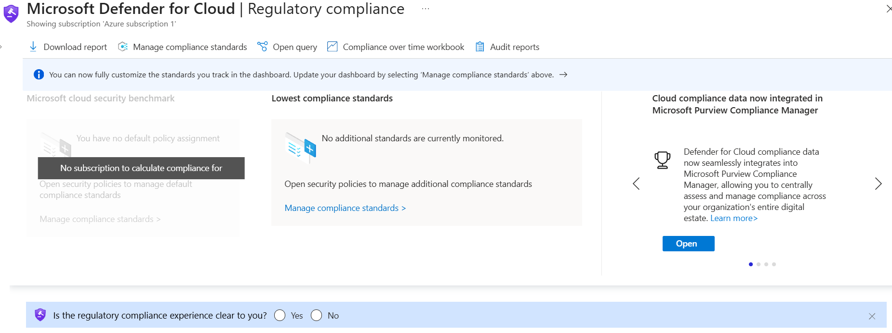
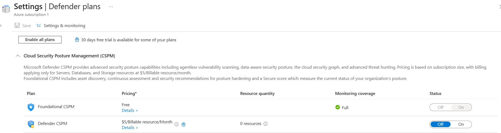

# Day 61 – Review Regulatory Compliance Dashboard

### Azure 100 Days of Cloud Challenge — Ali Aden

## Project Overview

In this project, I explored the **Regulatory Compliance** dashboard in **Microsoft Defender for Cloud** to understand how Azure measures security posture against recognised compliance frameworks.

The objective was to review the current compliance state of my subscription, investigate the available Defender plans, and understand the prerequisites required before compliance assessments can be performed.

Although my lab subscription did not support compliance assessments, this project helped me understand how Microsoft Defender for Cloud uses regulatory frameworks to measure and improve cloud security in production environments.

---

## Objectives

- Review the Regulatory Compliance dashboard.
- Investigate the current compliance state of the subscription.
- Review available Defender for Cloud plans.
- Understand the prerequisites for regulatory compliance assessments.
- Document the current lab environment and its limitations.

---

## Architecture

```text
                    Azure Subscription
                           │
                           ▼
            Microsoft Defender for Cloud
                           │
                           ▼
          Regulatory Compliance Dashboard
                     ┌─────────────┐
                     ▼             ▼
      No Policy Assignment   No Compliance Standards
                     │             │
                     └──────┬──────┘
                            ▼
                    Defender Plans
                            │
                            ▼
             Foundational CSPM Unavailable
                            │
                            ▼
             No Regulatory Assessments
                            │
                            ▼
               Current State Documented
```

This project focused on reviewing the current compliance configuration of my Microsoft Defender for Cloud environment. Since Foundational CSPM could not be enabled in my lab subscription, regulatory compliance assessments were unavailable. Instead, I documented the current state and learned how these features operate in a production environment.

---

## Azure Configuration

| Component | Configuration |
|------------|---------------|
| Cloud Platform | Microsoft Azure |
| Security Service | Microsoft Defender for Cloud |
| Subscription | Azure subscription 1 |
| Compliance Dashboard | Reviewed |
| Compliance Policy Assignment | Not Configured |
| Compliance Standards | None Assigned |
| Defender Plans | Reviewed |
| Foundational CSPM | Unavailable in Lab |
| Regulatory Assessments | Not Available |
| Deployment Type | Hands-on Lab & Documentation |

---

# Implementation

### 1. Reviewed the Regulatory Compliance Dashboard

I opened the Regulatory Compliance dashboard in Microsoft Defender for Cloud to review the current compliance state of my subscription. I confirmed that no compliance policy assignment or regulatory standards were available in my lab environment.

---

### 2. Reviewed Defender Plans

Next, I reviewed the Defender plans for my subscription to understand why compliance assessments were unavailable. I confirmed that Foundational CSPM could not be enabled, preventing Defender for Cloud from performing regulatory compliance assessments.

---

### 3. Investigated the Current Environment

Since compliance assessments were unavailable, I documented the current state of the environment instead of attempting to configure unsupported features. This helped me understand the prerequisites required before Defender for Cloud can assess Azure resources against regulatory frameworks.

---

# Validation

### Regulatory Compliance Dashboard



I confirmed that the Regulatory Compliance dashboard did not contain any compliance policy assignments or regulatory standards for my subscription.

---

### Defender Plans



I reviewed the Defender plans and confirmed that Foundational CSPM was unavailable in my lab subscription, which prevented regulatory compliance assessments from running.

---

# Skills Demonstrated

- Microsoft Defender for Cloud
- Regulatory Compliance
- Cloud Security Governance
- Defender Plans Management
- Cloud Security Posture Management (CSPM)
- Security Assessment Review
- Azure Security Best Practices
- Technical Documentation

---

# Project Outcome

In this project, I explored the Regulatory Compliance features in Microsoft Defender for Cloud and learned how Azure measures cloud resources against recognised security frameworks.

Although my lab subscription did not support regulatory compliance assessments, I reviewed the current configuration, investigated the available Defender plans and identified why compliance data was unavailable. This helped me understand the prerequisites required before Microsoft Defender for Cloud can assess resources against standards such as the Microsoft Cloud Security Benchmark and CIS Microsoft Azure Foundations Benchmark.

This project improved my understanding of cloud security governance, compliance monitoring and how Microsoft Defender for Cloud helps organisations measure and improve their security posture.