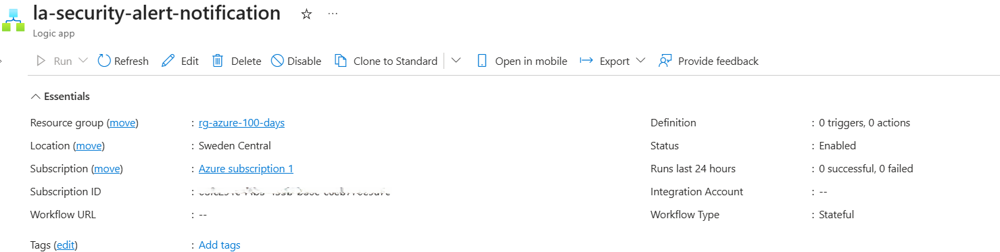
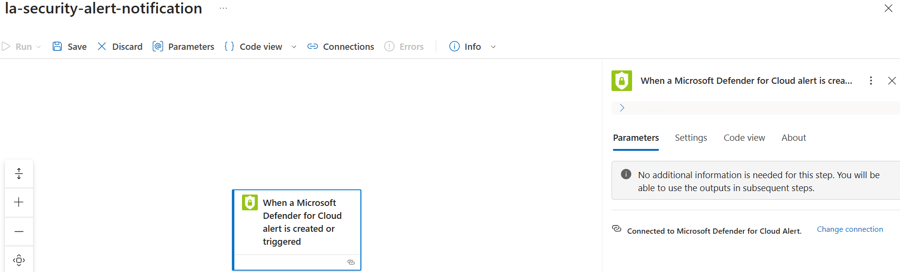
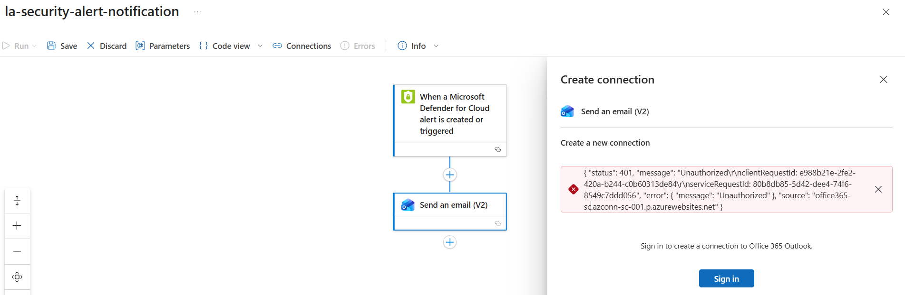

# Day 62 – Configure Workflow Automation for Security Alerts

### Azure 100 Days of Cloud Challenge — Ali Aden

## Project Overview

In this project, I configured a Logic App in Azure and integrated it with Microsoft Defender for Cloud to begin building an automated security alert workflow.

The goal was to trigger a Logic App whenever a Microsoft Defender for Cloud alert is generated and then send an email notification automatically. Although the Logic App and Defender for Cloud trigger were configured successfully, the final email action could not be completed because my lab environment does not include an Exchange Online mailbox required by the Office 365 Outlook connector.

This project helped me understand how Defender for Cloud integrates with Logic Apps to automate security operations and reduce manual response tasks.

---

## Objectives

- Deploy an Azure Logic App.
- Configure a Microsoft Defender for Cloud alert trigger.
- Add an email notification action.
- Investigate the Office 365 Outlook connection.
- Document the workflow and lab limitations.

---

## Architecture

```text
                    Day 62 – Workflow Automation for Security Alerts

+--------------------------------------------------------------+
|              Microsoft Defender for Cloud                    |
|                                                              |
|  Security Alert                                              |
|  (Alert Created or Triggered)                                |
+----------------------------+---------------------------------+
                             |
                             | Trigger
                             v
+--------------------------------------------------------------+
|                      Azure Logic App                         |
|                                                              |
|  la-security-alert-notification                              |
|                                                              |
|  Trigger: Defender for Cloud Alert                           |
|                                                              |
|  Action: Office 365 Outlook - Send an email (V2)             |
+----------------------------+---------------------------------+
                             |
                             | Connection Attempt
                             v
+--------------------------------------------------------------+
|                  Office 365 Outlook                          |
|                                                              |
|  Status: 401 Unauthorized                                    |
|                                                              |
|  Exchange Online mailbox not available                       |
|  (Lab licensing limitation)                                  |
+--------------------------------------------------------------+
```

The workflow begins when Microsoft Defender for Cloud generates a security alert. The Logic App is triggered and attempts to send an email using the Office 365 Outlook connector. In my lab environment, the workflow stopped at the email action because the tenant does not include an Exchange Online mailbox required by the Outlook connector.

---

## Azure Configuration

| Component | Configuration |
|------------|---------------|
| Cloud Platform | Microsoft Azure |
| Security Service | Microsoft Defender for Cloud |
| Automation Service | Azure Logic Apps (Consumption / Multi-tenant) |
| Logic App | la-security-alert-notification |
| Resource Group | rg-azure-100-days |
| Region | Sweden Central |
| Workflow Trigger | Microsoft Defender for Cloud Alert |
| Workflow Action | Office 365 Outlook – Send an email (V2) |
| Workflow Status | Partially Configured |
| Deployment Type | Hands-on Lab & Documentation |

---

# Implementation

### 1. Created the Logic App

I deployed a Consumption (Multi-tenant) Logic App named **la-security-alert-notification** in my Azure subscription. This Logic App acts as the automation engine that responds to Microsoft Defender for Cloud events.

---

### 2. Configured the Defender for Cloud Trigger

Next, I opened the Logic App Designer and added the **Microsoft Defender for Cloud Alert** trigger. This allows the workflow to start automatically whenever a supported security alert is created or triggered.

---

### 3. Added the Email Notification Action

After configuring the trigger, I added the **Office 365 Outlook – Send an email (V2)** action to notify administrators when a security alert is detected.

The email action could not be completed because my lab tenant does not include an Exchange Online mailbox. As a result, the Outlook connector returned a **401 Unauthorized** error when attempting to create the connection.

---

# Validation

### Logic App Deployment



I successfully deployed the Logic App and confirmed that it was enabled and ready for workflow configuration.

---

### Defender for Cloud Trigger



I configured the Microsoft Defender for Cloud alert trigger and confirmed that the Logic App was connected successfully without requiring any additional parameters.

---

### Email Connection Limitation



I added the Office 365 Outlook email action and investigated the connection failure. The connector returned a **401 Unauthorized** error because the lab environment does not include an Exchange Online mailbox required by the Outlook connector.

---

# Skills Demonstrated

- Microsoft Defender for Cloud
- Azure Logic Apps
- Workflow Automation
- Security Alert Automation
- Cloud Security Operations
- Office 365 Outlook Connector
- Troubleshooting Authentication Issues
- Azure Security Documentation

---

# Project Outcome

In this project, I built the foundation of an automated security response workflow using Microsoft Defender for Cloud and Azure Logic Apps.

I successfully deployed a Logic App, configured a Microsoft Defender for Cloud alert trigger and added an Office 365 Outlook email action. While testing the workflow, I identified that my lab environment does not include an Exchange Online mailbox, which prevented the Outlook connector from creating a connection.

Although the email notification could not be completed, this project helped me understand how Defender for Cloud integrates with Logic Apps to automate security workflows and highlighted the licensing requirements needed for production environments.