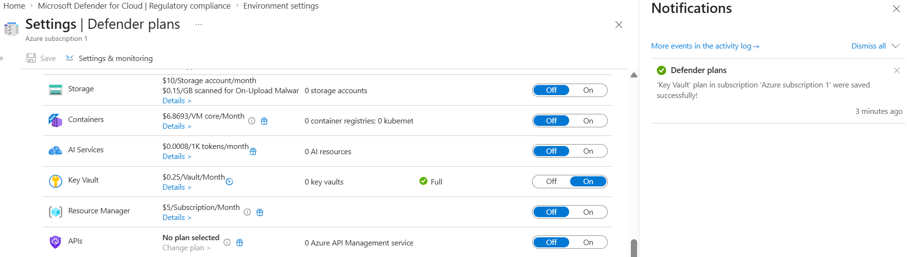

# Day 63 – Enable Microsoft Defender Plans

### Azure 100 Days of Cloud Challenge — Ali Aden

## Project Overview

In this project, I explored **Microsoft Defender for Cloud Defender Plans** to understand how Azure provides workload-specific threat protection beyond the free security recommendations.

I reviewed the available Defender plans, compared their pricing and protection capabilities, and enabled **Microsoft Defender for Key Vault**. I then verified the configuration using both the Azure portal and Azure CLI to confirm that the Defender plan had been successfully enabled.

This project helped me understand how Defender plans are enabled on a workload-by-workload basis and why organisations make security decisions based on both risk and cost rather than simply enabling every available plan.

---

## Objectives

- Review the available Microsoft Defender plans.
- Compare Defender plan pricing and workload protection.
- Enable Microsoft Defender for Key Vault.
- Verify the Defender plan using Azure Portal.
- Validate the configuration using Azure CLI.

---

## Architecture

```text
                    Day 63 – Enable Microsoft Defender Plans

+--------------------------------------------------------------+
|              Microsoft Defender for Cloud                    |
|                                                              |
|               Environment Settings                           |
+----------------------------+---------------------------------+
                             |
                             | Review Plans
                             v
+--------------------------------------------------------------+
|               Defender Plan Review                           |
|                                                              |
|  Servers      Storage      Databases      Containers          |
|                     Key Vault                                |
+----------------------------+---------------------------------+
                             |
                             | Risk & Cost Evaluation
                             v
+--------------------------------------------------------------+
|                Defender for Key Vault                        |
|                                                              |
|  Status: Standard                                            |
|  Monitoring: Full                                            |
|  Pricing: PerKeyVault                                        |
+----------------------------+---------------------------------+
                             |
                             | Validation
                             v
+--------------------------------------------------------------+
|                 Configuration Verified                       |
|                                                              |
|  ✓ Defender Plan Enabled                                     |
|  ✓ Azure Portal Confirmed                                    |
|  ✓ Azure CLI Verified                                        |
+--------------------------------------------------------------+
```

The workflow begins in **Microsoft Defender for Cloud**, where I reviewed the available Defender plans for my subscription. After comparing their pricing and workload coverage, I selected **Defender for Key Vault** because it provided the most appropriate protection for my lab while keeping costs low. Finally, I verified the successful configuration using both the Azure portal and Azure CLI.

---

## Azure Configuration

| Component | Configuration |
|------------|---------------|
| Cloud Platform | Microsoft Azure |
| Security Service | Microsoft Defender for Cloud |
| Feature | Defender Plans |
| Enabled Plan | Defender for Key Vault |
| Resource Group | rg-azure-100-days |
| Region | Sweden Central |
| Defender Tier | Standard |
| Pricing Model | PerKeyVault |
| Validation | Azure Portal & Azure CLI |
| Deployment Type | Hands-on Lab & Documentation |

---

# Implementation

### 1. Reviewed Microsoft Defender Plans

I opened **Environment Settings** within Microsoft Defender for Cloud and reviewed the Defender plans available for my subscription. I compared the protection offered by each workload-specific plan, including Servers, Storage, Databases, Containers and Key Vault, while also reviewing their associated pricing.

---

### 2. Enabled Defender for Key Vault

After reviewing the available plans, I enabled **Microsoft Defender for Key Vault**. This provides advanced threat detection and monitoring for Azure Key Vault resources. Azure successfully applied the configuration and confirmed that the Defender plan had been enabled.

---

### 3. Validated the Configuration

To confirm the configuration, I verified the Defender plan in the Azure portal and then used the Azure CLI by running:

```bash
az security pricing list -o json
```

The Azure CLI confirmed that the **KeyVaults** pricing tier had changed to **Standard**, verifying that the Defender plan was successfully enabled.

---

# Validation

### Defender for Key Vault Enabled



I successfully enabled **Microsoft Defender for Key Vault** within Microsoft Defender for Cloud. The portal confirmed that the Defender plan was enabled successfully and that monitoring was active for the Key Vault workload. I also validated the configuration using the Azure CLI, which confirmed that the **KeyVaults** pricing tier had changed to **Standard**.

---

# Skills Demonstrated

- Microsoft Defender for Cloud
- Microsoft Defender Plans
- Azure Security
- Azure Key Vault Protection
- Workload Protection
- Azure Portal
- Azure CLI
- Security Configuration Validation
- Cost-Aware Security Planning

---

# Project Outcome

In this project, I reviewed the Defender plans available in Microsoft Defender for Cloud and gained a better understanding of how workload-specific protection is applied across Azure resources.

I enabled **Microsoft Defender for Key Vault**, validated the configuration using both the Azure portal and Azure CLI, and explored how Defender plans balance security capabilities with operational cost. This project strengthened my understanding of workload protection and demonstrated how cloud security engineers make risk-based decisions when selecting security services rather than enabling every available feature.