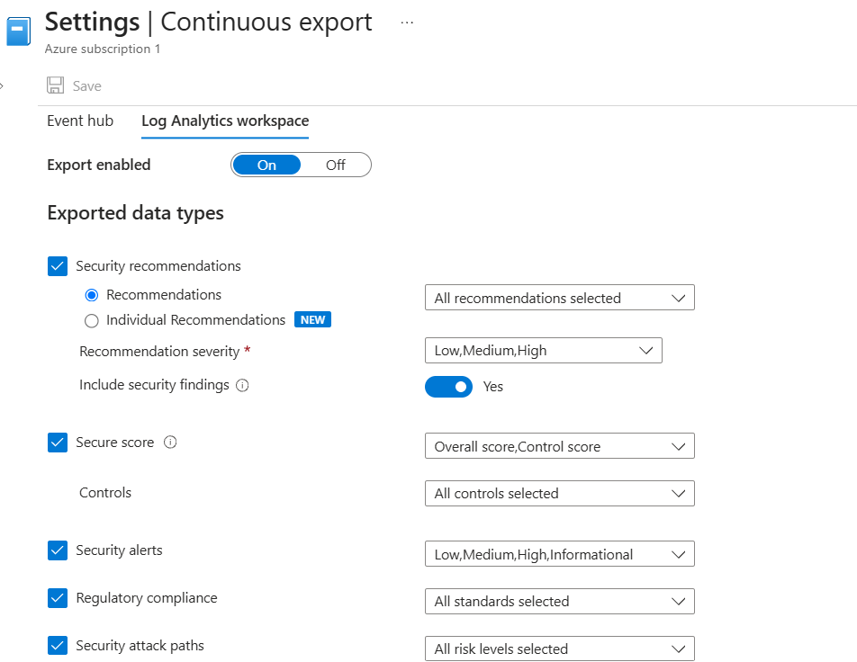
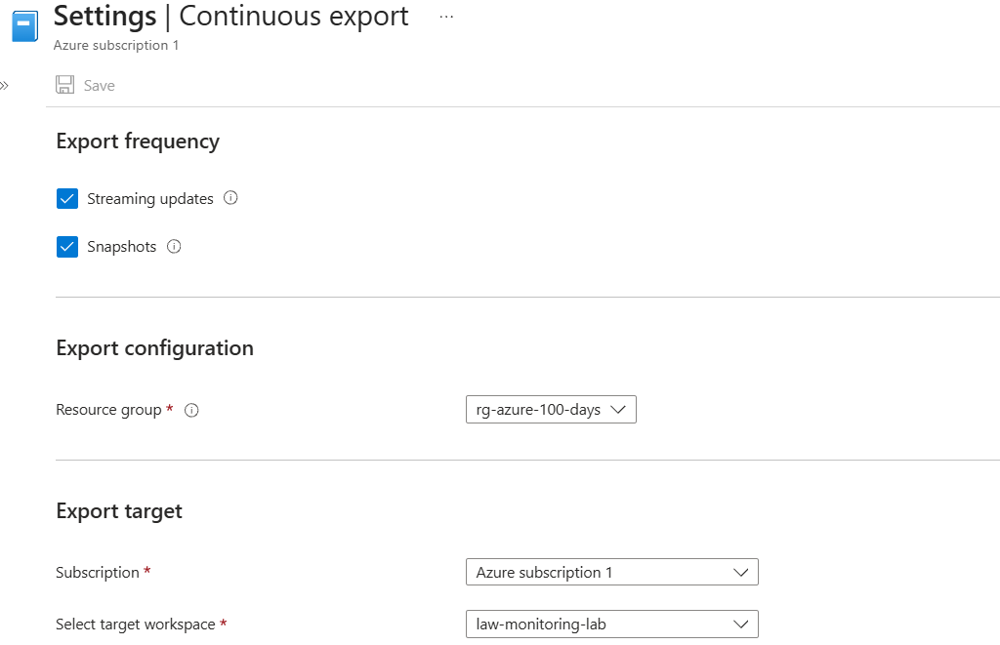
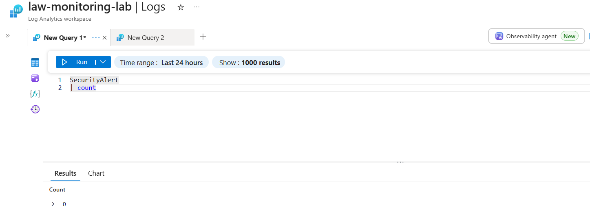
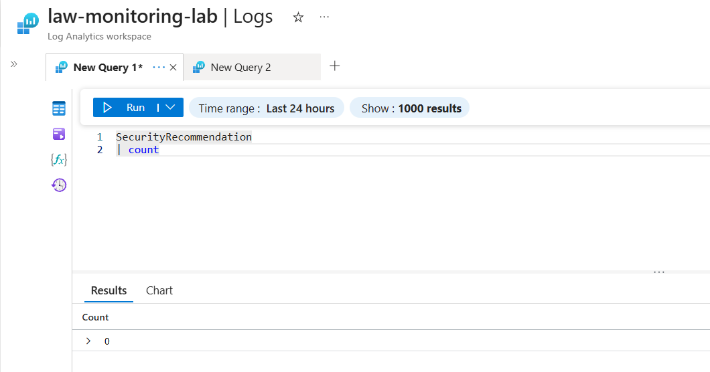

# Day 64 – Export Defender for Cloud Data to Log Analytics

### Azure 100 Days of Cloud Challenge — Ali Aden

## Project Overview

In this project, I configured **Continuous Export** in **Microsoft Defender for Cloud** to automatically stream security data into an Azure Log Analytics Workspace.

I configured Continuous Export to send **Security Recommendations**, **Secure Score**, **Security Alerts**, **Regulatory Compliance**, and **Security Attack Paths** to my existing Log Analytics workspace. I then validated the configuration by running KQL queries against the exported tables to confirm that the export pipeline was working correctly.

Although no new Defender for Cloud events had been generated since enabling Continuous Export, the Log Analytics tables were successfully created and returned zero records, confirming that the environment was ready to receive future security telemetry.

This project helped me understand how Defender for Cloud integrates with Log Analytics to provide long-term security monitoring, custom KQL analysis, and future Microsoft Sentinel integration.

---

## Objectives

- Configure Continuous Export in Microsoft Defender for Cloud.
- Export security data to a Log Analytics Workspace.
- Configure streaming updates for continuous monitoring.
- Validate exported security tables using KQL.
- Understand how Defender for Cloud integrates with Log Analytics.

---

## Architecture

```text
                Day 64 – Export Defender for Cloud Data to Log Analytics

+--------------------------------------------------------------+
|              Microsoft Defender for Cloud                    |
|                                                              |
| Continuous Export                                            |
|                                                              |
| • Security Recommendations                                   |
| • Secure Score                                               |
| • Security Alerts                                            |
| • Regulatory Compliance                                      |
| • Security Attack Paths                                      |
+----------------------------+---------------------------------+
                             |
                             | Streaming Updates
                             |
                             v
+--------------------------------------------------------------+
|              Log Analytics Workspace                         |
|                                                              |
| Workspace: law-monitoring-lab                                |
|                                                              |
| Long-term Security Data Storage                              |
+----------------------------+---------------------------------+
                             |
                             | KQL Queries
                             |
                             v
+--------------------------------------------------------------+
|                    Security Analysis                         |
|                                                              |
| SecurityAlert              Records: 0                        |
| SecurityRecommendation     Records: 0                        |
|                                                              |
| Export validated and ready for future telemetry              |
+--------------------------------------------------------------+
```

The workflow begins in **Microsoft Defender for Cloud**, where Continuous Export streams security data directly into my **law-monitoring-lab** Log Analytics Workspace. Once the data reaches the workspace, I can query it using KQL to analyse security alerts, recommendations and other Defender for Cloud data. At the time of validation, no new security events had been generated, so both tables returned zero records while confirming that the export pipeline had been configured successfully.

---

## Azure Configuration

| Component | Configuration |
| ---------- | ------------- |
| Cloud Platform | Microsoft Azure |
| Security Service | Microsoft Defender for Cloud |
| Feature | Continuous Export |
| Export Destination | Log Analytics Workspace |
| Workspace | law-monitoring-lab |
| Resource Group | rg-azure-100-days |
| Region | Sweden Central |
| Export Mode | Streaming Updates & Snapshots |
| Validation | Azure Portal & KQL |
| Deployment Type | Hands-on Lab & Documentation |

---

# Implementation

### 1. Configured Continuous Export

I opened **Environment Settings** in Microsoft Defender for Cloud and configured **Continuous Export** for my subscription. I enabled exporting security data to my existing **law-monitoring-lab** Log Analytics Workspace.

I selected the following data types for export:

- Security Recommendations
- Secure Score
- Security Alerts
- Regulatory Compliance
- Security Attack Paths

I also enabled **Streaming Updates** and **Snapshots** so that future security data would be exported automatically.

---

### 2. Configured the Log Analytics Workspace

Next, I selected my existing **law-monitoring-lab** Log Analytics Workspace as the export destination.

This configuration allows Defender for Cloud to continuously stream supported security data into Log Analytics, where it can be queried using KQL, retained for longer periods, and integrated with Microsoft Sentinel in future projects.

---

### 3. Validated the Export Configuration

To verify the configuration, I opened **Logs** within my Log Analytics Workspace and ran the following KQL queries:

```kusto
SecurityAlert
| count
```

```kusto
SecurityRecommendation
| count
```

Both queries completed successfully and returned **0 records**.

Although no new Defender for Cloud events had been generated since enabling Continuous Export, the successful queries confirmed that both tables had been created and that the export pipeline was configured correctly and ready to receive future security telemetry.

---

# Validation

### Continuous Export Configuration



I configured Continuous Export within Microsoft Defender for Cloud and enabled the export of Security Recommendations, Secure Score, Security Alerts, Regulatory Compliance and Security Attack Paths.

---

### Log Analytics Workspace Configuration



I configured **law-monitoring-lab** as the target Log Analytics Workspace and enabled Streaming Updates and Snapshots to continuously export Defender for Cloud security data.

---

### SecurityAlert Table Validation



I queried the **SecurityAlert** table using KQL. The query completed successfully and returned zero records, confirming that the table existed and was ready to receive future Defender for Cloud alerts.

---

### SecurityRecommendation Table Validation



I queried the **SecurityRecommendation** table using KQL. The query returned zero records, confirming that Continuous Export had successfully created the table and that it was ready to store future recommendation data.

---

# Skills Demonstrated

- Microsoft Defender for Cloud
- Continuous Export
- Azure Log Analytics
- Kusto Query Language (KQL)
- Azure Security Monitoring
- Security Data Export
- Log Analytics Workspace
- Azure Portal
- Security Validation
- Microsoft Sentinel Integration Fundamentals

---

# Project Outcome

In this project, I configured **Continuous Export** in Microsoft Defender for Cloud to stream security data into Azure Log Analytics.

I successfully configured the export destination, enabled multiple Defender for Cloud data types, and validated the configuration using KQL queries against the **SecurityAlert** and **SecurityRecommendation** tables. Although no new Defender for Cloud events had been generated at the time of testing, the successful queries confirmed that the export pipeline was configured correctly and ready to ingest future security telemetry.

This project strengthened my understanding of how Defender for Cloud integrates with Log Analytics to provide long-term security monitoring, custom KQL analysis and the foundation for future Microsoft Sentinel integration.